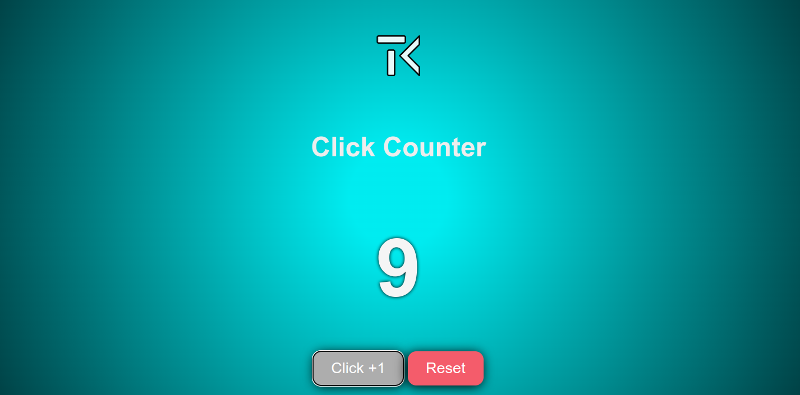
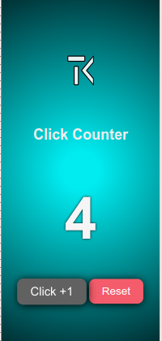

# React Curso en Espanol
- file structure by Vite
- uses prefered color scheme for dark and light mode defined by user system

## Counter functionality
- fully responsive
- button 1 : add + 1
- button 2 : reset
- counter : number of clicks
- animated transitios between old value and new value

## Screenshots

## Author
[@TiborKopca](https://github.com/TiborKopca)